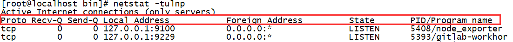

# 追踪Linux端口占用情况

- ## `netstat`
```bash
	netstat -anlp | grep 8888
    # netstat命令各个参数说明如下：
    # -t : 指明显示TCP端口 
    # -u : 指明显示UDP端口 
    # -l : 仅显示监听套接字(所谓套接字就是使应用程序能够读写与收发通讯协议(protocol)与资料的程序) 
    # -p : 显示进程标识符和程序名称，每一个套接字/端口都属于一个程序。 
    # -n : 不进行DNS轮询，显示IP(可以加速操作) 
```



对输出的每一项进行说明：

(1) Proto：协议名（tcp协议还是udp协议)

(2) Recv-Q：网络接收队列。表示收到的数据已经在本地接收缓冲，但是还有多少没有被进程取走。如果接收队列Recv-Q一直处于阻塞状态，可能是遭受了拒绝服务 denial-of-service 攻击。通常应该为0，如果不为0可能是有问题的。packets在两个队列里都不应该有堆积状态。可接受短暂的非0情况。

(3) Send-Q：网路发送队列。对方没有收到的数据或者说没有Ack的,还是本地缓冲区。如果发送队列Send-Q不能很快的清零，可能是有应用向外发送数据包过快，或者是对方接收数据包不够快。通常应该为0，如果不为0可能是有问题的。packets在两个队列里都不应该有堆积状态。可接受短暂的非0情况。

(4) Local Address

- 0.0.0.0:22 表示监听服务器上所有ip地址的所有(0.0.0.0表示本地所有ip)
- :::22 也表示监听本地所有ip的22端口，跟上面的区别是这里表示的是IPv6地址，上面的0.0.0.0表示的是本地所有IPv4地址。
- 127.0.0.1:9100这个表示监听本机的loopback地址的9100端口(如果某个服务只监听了回环地址，那么只能在本机进行访问，无法通过tcp/ip 协议进行远程访问)
(5) Foreign Address：与本机端口通信的外部socket。显示规则与Local Address相同

(6) State：链路状态，共有11种。state列共有12中可能的状态，前面11种是按照TCP连接建立的三次握手和TCP连接断开的四次挥手过程来描述的。
- LISTEN：监听来自远方TCP端口的连接请求
- ESTABLISHED：代表一个打开的连接，双方可以进行或已经在数据交互了。
- UNKNOWN：未知的socket状态

(7)  PID/Program：PID即进程id，Program即使用该socket的应用程序

- ## `ss`
```bash
ss -anlp | grep 80
```

- ## `lsof`
可以查看进程对文件的占用情况
```bash
lsof -i:80
```

- ## `fuser`
fuser命令和lsof正好相反，是查看某个文件被哪个进程占用的，Linux中，万物皆文件，所以可以查看普通文件、套接字文件、文件系统。而套接字文件就包含了端口号。比如查看22端口。
```bash
fuser 22/tcp -v
```

- ## `nmap`
nmap默认总是会扫描端口，要扫描本机端口，很方便。
```bash
nmap localhost
```