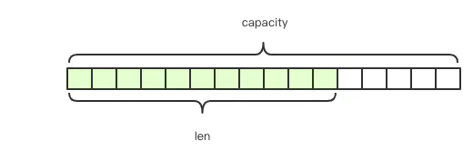
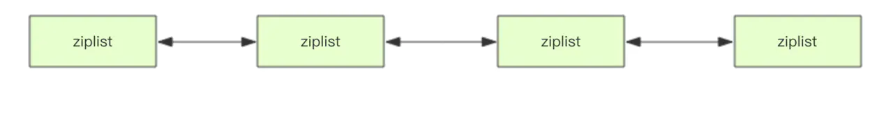
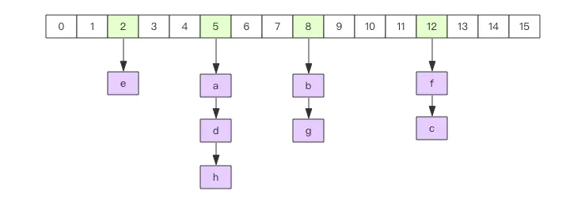
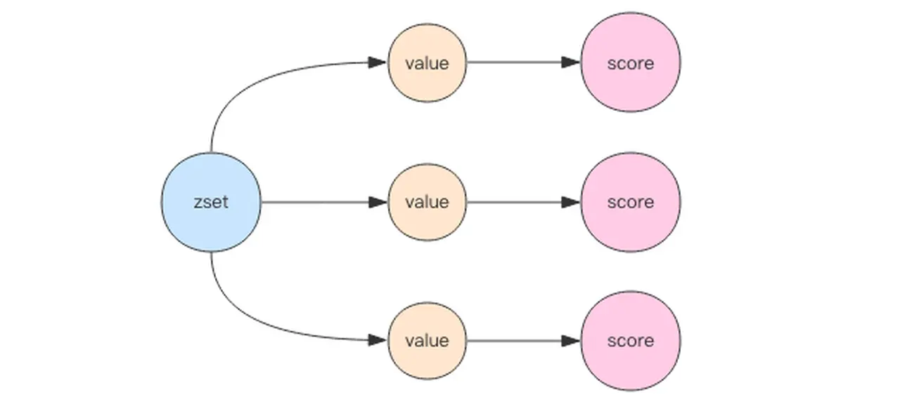
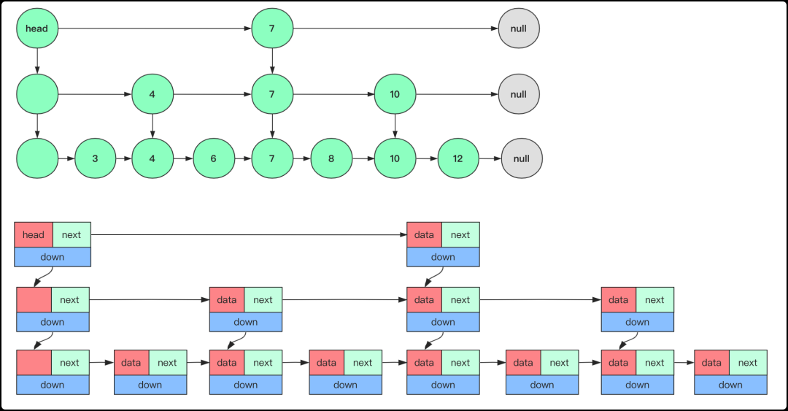
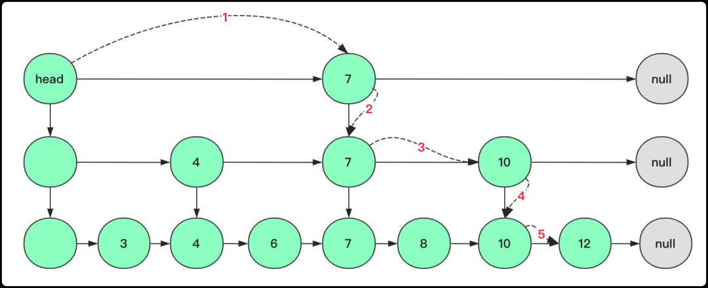
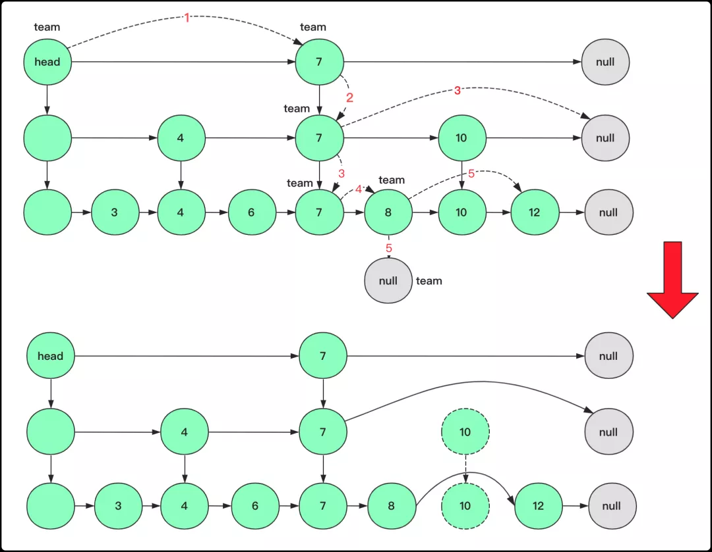
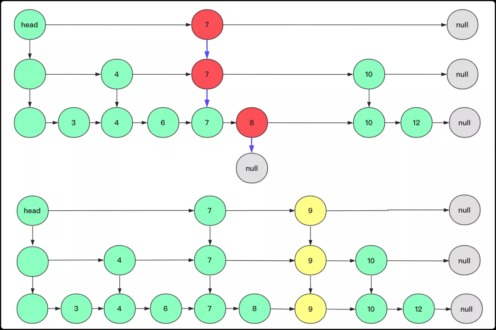

# 基本数据结构

- ## string

- 

-  string 是一种可变的字节数组，结构类似 `golang` 的 slice ，属性除了字面值以外还包括长度（ len ）及容量（ cap ），其中 cap >= len ，容量最大为 512M 

- string 扩容

	- 当目前的字符串长度小于 1M 时，每次扩容加倍现有空间
	- 当长度超过 1M 时，每次扩容只增加 1M 空间

- ## list

- 

-  list 是一种双向链表，随即定位的性能不是十分优秀，但是首尾插入删除性能优异。同时，list 的下标可以为负，即从尾开始。此外，list 支持 `rpush/rpop/lpush/lpop` 等命令可以轻松的构造成队列、堆栈。

- ### 快速列表
- 
	在 redis 底层，list 的存储结构并非一个简单的链表，而是一种 quicklist 结构。quidklist 将多个   ziplist 通过双向指针组成了一个宏观上的 “linkedlist”。
	在 list 的元素较少时会采用一块连续的内存进行数据存储，这个结构是 ziplist，即为压缩列表。数据量大时，便将数据分成多个部分，每个部分存储为一个 ziplist ，再将多个 ziplist 通过双向指针链接为 quicklist 。
	
- ## hash

- 

-  hash 是一种二维结构，第一维是数组，第二位是链表。其中 hash 的 key 与 value 存储在链表中，数组存放链表的头指针。

- hash 查找
	通过 key 来查找 value 时，会先计算 key 的 hashcode ，然后用 hashcode 对数组`取模`，定位要查找的 key 所在的链表的表头在数组的位置，然后遍历相应链表获取所需 value 。链表的作用就是用来将产生了「 hash 碰撞」的元素串起来。
	
- hash 扩容
	当hash内部元素比较拥挤时(即`hash碰撞`比较频繁)，则需扩容。
	
	- 当hash不是很大时
		申请两倍大小的数组，将所有键值对重新分配到新的数组下标对应的链表中，这个过程称为 `refresh`。
	- 当hash很大时
		当hash很大时，单线程的 redis 完成一次 `refresh`会有很大压力。此时 redis 采用了`渐进式 refresh` 的方案。
		首先 redis 会同时保留两个新旧 hash 结构，然后会通过`定时任务` 以及 `对 hash 的不断读写` 将原hash中的元素逐渐迁移到新的结构中。这样就可以避免 redis 的卡顿。

- hash 缩容
	原理与扩容类似，仅数组缩小一半。

- ## set
	在内部采用 hash 实现，所有的 value 都指向同一个内部值，使用时只关注 key 。

- ## sortedset(zset)

- 

-	sortedset(zset) 的底层实现有两部分，一部分是 hash ，一部分是跳跃链表 (skiplist) 。
	- hash 将元素 value 与 权重 score 关联起来，可以保障 value 的唯一性，并能通过 value 找到其 score 。
	- skiplist 的目的是给元素 value 排序，并可以根据 score 的范围获取元素列表。

- ### skiplist

- 

- skiplist 是在有序链表上增加了多级索引，通过索引来实现快速查找。可以被看作是一种支持二分查找的有序链表。性能与红黑树、AVL 树不相上下。

- 查找

- 
	
	1. 取 `team := head.right` ，如果 team 的 key 与查询的 key 相等，那么返回当前节点；
	2. 如果不相等且 `team.right == nil`，此时 `team = team.down`；
	3. 如果此时的 key 小于 目标 key ，则同级向右查询，`team = team.right`；
	4. 如果此时的 key 小于 目标 key，且` team.right == nil`，此时 `team = team.down`；
	5. 如果此时的 key 小于 目标 key ，则同级向右查询，`team = team.right`，找到目标 key 。

- 删除

- 

	1. 取 `team := head.right` ，如果当前 key 小于 目标 key，且 ` team.right == nil`；
	2. `team = team.down`；
	3. 如果此时的 key 小于 目标 key ，则同级向右查询，若右侧节点的 key 与目标 key 相同，则将 当前节点的 right 指向 右侧节点的 right ，再令 `team = team.down`；
	4. 如果此时的 key 小于 目标 key ，则同级向右查询， `team = team.right`，若此时的 key 小于目标 key，则同级向右查询；
	5. 若右侧节点的 key 与目标 key 相同，则将 当前节点的 right 指向 右侧节点的 right 。

- 插入

- 

	插入操作需要考虑是否插入索引，插入几层。redis 采用随机化的方法判断是否向上层插入索引，